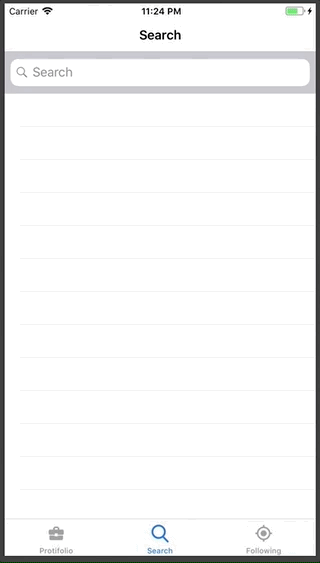
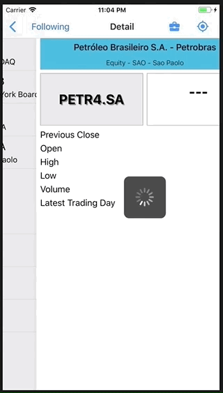

# Following Stocks

-------

    <a href="#the-Project">The Project</a> &bull;
    <a href="#prerequisites">Prerequisites</a> &bull;
    <a href="#functionalities">Functionalities</a> &bull;
    <a href="#used-APIs">Used APIs</a> &bull;
    <a href="#restrictions">Restrictions</a> &bull;
    <a href="#license">License</a> &bull;
    <a href="#author">Author</a>

-------

# The Project
Following Stocks is an application that allows, in a simplified form, to consult stock quotes and follow stocks (stocks, currencies and futures) traded through various stock exchanges around the world.

# Prerequisites
IOS 11.3+

# Development
The application was developed in Swift 4, using Xcode 9.4.1

# Functionalities

## Search for
In Search View, you can find for stocks by the name of the stocks, company, or symbol (identification of paper in stock exchanges)

> 

## Following
The Following tab shows the papers marked by the user to be followed.

> 

## Portfolio
In the Portfolio tab, the user views his portfolio of stocks. From this tab, you can also add new papers to the portfolio.

> 

## Detail
In the Detail view, the user can check more detailed data of the paper quote. Within details, the user has an option of:

- Add or remove paper from the portfolio;
- mark or unmark the paper as "following".

> 

# Used APIs
Following Stocks uses two APIs as a basis, which enable the user to consult stocks in stock exchanges around the world:

 - [Alpha Vantage](https://www.alphavantage.co/) - Allows you to check the paper price in real time;
 - [Yahoo Finance Auto Complete](https://stackoverflow.com/questions/52390536/javascript-jquery-get-request-is-not-getting-data-or-returning-any-error) - Used in auto completion of search for stock exchange papers, from the company name or the paper symbols. Note: This API document was not found, but was 'sifting' in stackoverflow until the location used in the following Stocks was reached.

# Restrictions
Because it is an academic and demonstrative project, the Following Stocks had no injected budget and used a free version of the Alpha Vantage API that only allows  5 quotation queries per hour or 500 queries per day. With this the following Stocks were modeled as follow:

- The user can follow up to 5 papers stocks;
- The user can add up to 5 papers stocks in the portfolio;
- Every 1 minute, Follokwing Stocks updates the most outdated paper quote;
- Quotation queries, in addition to automatic queries, are only applied when entering the detail view;
- If the user has performed more than 4 queries in the one minute interval, a message is displayed for the user to wait a few moments to carry out the next query.

# License
This project is licensed based on GLP v3 license - See the License.md file for more details.

# Author
Bruno Wagner https://github.com/brunowagner/
